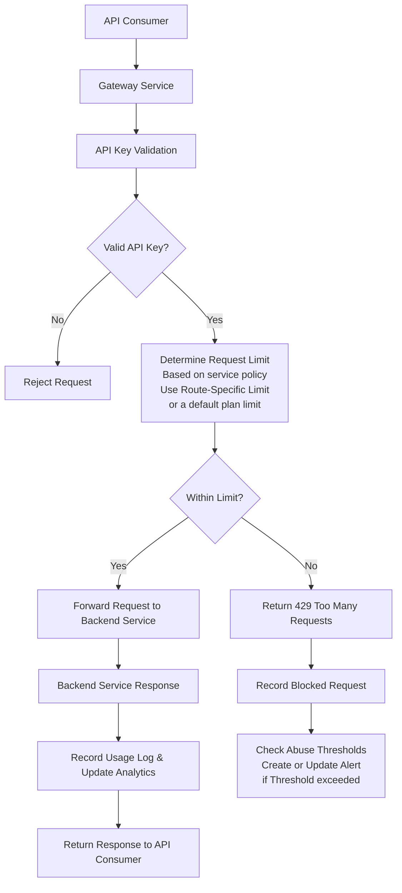
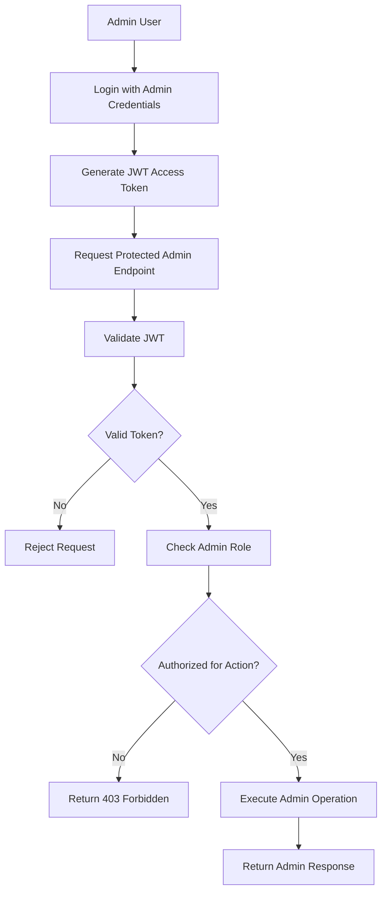

# Smart API Gateway

A self-hostable API gateway and API management platform built with Spring Boot, Redis, PostgreSQL, and Docker.

Features include:
- distributed Redis-backed rate limiting
- plan-based quotas
- route-specific throttling
- JWT authentication
- role-based authorization
- usage analytics
- abuse detection

Designed as a developer-friendly, SaaS-oriented gateway platform for small-to-mid sized teams.

## Why This Project?

Modern applications increasingly rely on API gateways for authentication,
traffic management, rate limiting, observability, and security.

Existing solutions such as Kong, AWS API Gateway, Apigee, and NGINX-based setups
are powerful, very expensive and often optimized toward either:

- infrastructure-heavy configurations
- enterprise-scale deployments
- or paid platform ecosystems

At the same time, many free open-source gateway solutions provide strong routing and proxy capabilities but lack 
built-in product-oriented features such as:
- plan-based quota management
- integrated analytics
- abuse monitoring
- developer-focused administration
- and simplified onboarding experiences

Smart API Gateway was built to explore a middle ground:
a developer-first, self-hostable API management platform that combines infrastructure capabilities with SaaS-style management features.

The goal is not to compete with low-level high-performance proxies,
but to provide a more accessible and product-oriented gateway experience for developers, startups, and small-to-mid sized teams.

## Architecture Overview

Smart API Gateway is designed as a containerized, multi-service backend system where the gateway acts as the central policy enforcement layer between API consumers and backend services.

Instead of acting only as a request router, the gateway is responsible for enforcing access rules, applying traffic policies, recording usage, detecting abuse, and protecting administrative platform features.

The architecture is easiest to understand through two main request flows:

1. **API Consumer Flow** — requests made by external clients using API keys
2. **Admin Platform Flow** — requests made by admins using JWT authentication and role-based authorization

### API Consumer Flow

This flow represents requests made by external API consumers to protected backend services.

### API Consumer Flow

This flow represents requests made by external API consumers to protected backend services.

### Admin Platform Flow

Admin authentication is intentionally separated from API consumer authentication. API consumers access protected backend services using API keys, while platform administrators use JWT-based authentication to manage internal gateway resources and administrative features.

The platform currently supports two administrative roles:

- `READ_ONLY_ADMIN` — can access read-only administrative endpoints such as analytics, usage statistics,view clients, plans, route specific policies and abuse alerts
- `SUPER_ADMIN` — has full administrative access, including managing clients, plans, route policies, and other gateway configuration resources

This separation allows the platform to enforce role-based access control for sensitive management operations while still supporting restricted monitoring and observability access.

