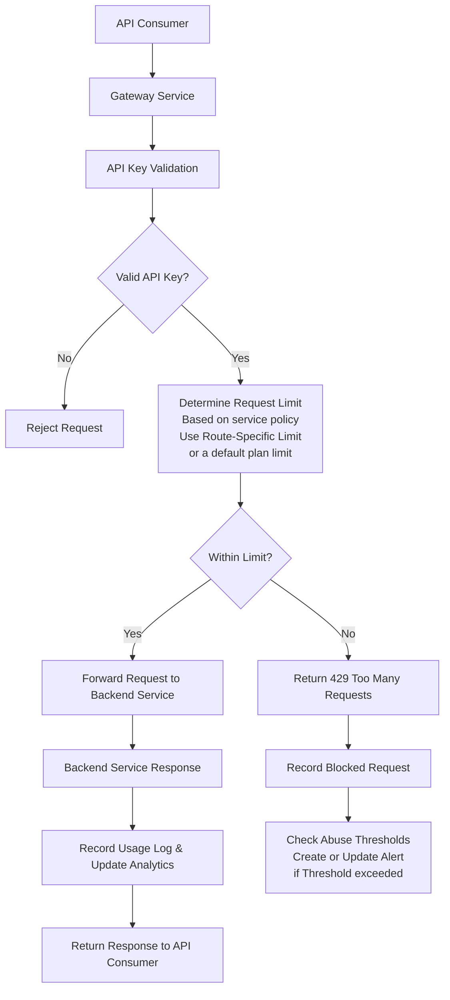
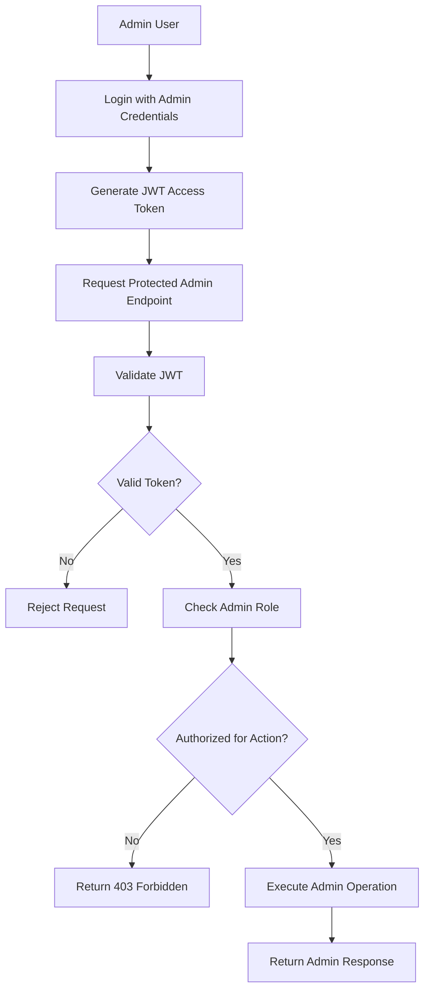

# Smart API Gateway

A self-hostable API gateway and API management platform built with Spring Boot, Redis, PostgreSQL, and Docker.

Features include:
- distributed Redis-backed rate limiting
- plan-based quotas
- route-specific throttling
- JWT authentication
- role-based authorization
- usage analytics
- abuse detection

Designed as a developer-first, SaaS-oriented gateway platform for small-to-mid sized teams.

## Why This Project?

Modern applications increasingly rely on API gateways for authentication,
traffic management, rate limiting, observability, and security.

Existing solutions such as Kong, AWS API Gateway, Apigee, and NGINX-based setups
are powerful, but can be very expensive and often optimized toward either:

- infrastructure-heavy configurations
- enterprise-scale deployments
- or paid platform ecosystems

At the same time, many free open-source gateway solutions provide strong routing and proxy capabilities but lack 
built-in product-oriented features such as:
- plan-based quota management
- integrated analytics
- abuse monitoring
- developer-focused administration
- and simplified onboarding experiences

Smart API Gateway was built to explore a middle ground:
a developer-first, self-hostable API management platform that combines infrastructure capabilities with SaaS-style management features.

The goal is not to compete with low-level high-performance proxies,
but to provide a more accessible and product-oriented gateway experience for developers, startups, and small-to-mid sized teams.

## Architecture Overview

Smart API Gateway is designed as a containerized, multi-service backend system where the gateway acts as the central policy enforcement layer between API consumers and backend services.

Instead of acting only as a request router, the gateway is responsible for enforcing access rules, applying traffic policies, recording usage, detecting abuse, and protecting administrative platform features.

The architecture is easiest to understand through two main request flows:

1. **API Consumer Flow** — requests made by external clients using API keys
2. **Admin Platform Flow** — requests made by admins using JWT authentication and role-based authorization

### API Consumer Flow

This flow represents requests made by external API consumers to protected backend services.




### Admin Platform Flow

Admin authentication is intentionally separated from API consumer authentication. API consumers access protected backend services using API keys, while platform administrators use JWT-based authentication to manage internal gateway resources and administrative features.

The platform currently supports two administrative roles:

- `READ_ONLY_ADMIN` — can access read-only administrative endpoints such as analytics, usage statistics,view clients, plans, route specific policies and abuse alerts
- `SUPER_ADMIN` — has full administrative access, including managing clients, plans, route policies, and other gateway configuration resources

This separation allows the platform to enforce role-based access control for sensitive management operations while still supporting restricted monitoring and observability access.



### Infrastructure & Service Responsibilities

The system is separated into multiple services so each component has a clear responsibility.

#### Gateway Service

The Gateway Service is the core application in the system. It acts as the central policy enforcement layer for incoming traffic.

Responsibilities include:

- validating API keys for API consumers
- resolving plan-based and route-specific rate limits
- forwarding valid requests to backend services
- recording usage logs for analytics
- tracking blocked requests for abuse detection
- protecting admin endpoints with JWT authentication and role-based authorization

#### Redis

Redis is used for fast, shared rate-limiting counters.

Rate limit state is kept outside the gateway process so the system is not dependent on local application memory. This allows multiple gateway instances to share request counters and supports a more horizontally scalable design.

#### PostgreSQL

PostgreSQL stores persistent platform data such as:

- clients and API keys
- plans and quota rules
- route-specific limits
- usage logs
- abuse alerts
- admin users and roles

#### Backend Service

The Backend Service is a demo service used to validate gateway behavior.

It exists mainly for routing demonstrations, integration testing, and showing how protected backend APIs can sit behind the gateway.

#### Docker Compose

Docker Compose is used to run the full system locally with separate containers for the gateway, backend service, Redis, and PostgreSQL.

This creates a more production-like development environment and demonstrates container networking, service isolation, and infrastructure configuration.

## Core Features

### Traffic Management

#### Plan-Based Rate Limiting

Clients are assigned to centralized plans such as `FREE`, `PRO`, and `ENTERPRISE`, each with configurable default request quotas.

This allows quota policies to be managed centrally without duplicating configuration across individual clients.

#### Route-Specific Traffic Policies

The gateway supports route-level rate limit overrides for endpoints with different operational costs.

For example, expensive endpoints such as AI inference, image generation, or report-processing APIs can enforce stricter limits than lightweight endpoints, even when clients belong to the same plan.

When a route-specific policy exists, it overrides the default plan quota for that endpoint.

#### Distributed Redis-Backed Rate Limiting

Rate limiting uses Redis-based shared counters instead of local in-memory tracking.

This allows multiple gateway instances to share rate limit state consistently and supports a more horizontally scalable architecture compared to application-local counters.

#### Centralized Policy Enforcement

Traffic policies are enforced at the gateway layer before requests reach backend services.

This allows authentication, quota enforcement, and traffic control to remain centralized rather than being duplicated across individual backend applications.

### Authentication & Authorization

#### API Key Authentication

External API consumers authenticate using API keys provided through the `X-API-Key` header.

Requests are validated at the gateway layer before traffic is forwarded to backend services.

#### JWT-Based Admin Authentication

Administrative platform endpoints are protected using JWT-based authentication.

Admins authenticate through a login endpoint and receive a signed JWT access token used for subsequent protected requests.

#### Role-Based Authorization

Administrative actions are protected using role-based access control.

Current roles include:

- `READ_ONLY_ADMIN` — can access monitoring and observability endpoints such as analytics, usage statistics, and abuse alerts
- `SUPER_ADMIN` — has full access to management operations including clients, plans, route policies, and administrative configuration

This separation allows sensitive platform operations to remain protected while still supporting restricted operational visibility for lower-privileged administrators.

#### Centralized Security Enforcement

Authentication and authorization are enforced centrally at the gateway layer rather than being duplicated across backend services.

This keeps security policies consistent across the platform and simplifies backend service design.## Analytics & Abuse Detection

### Analytics & Abuse Detection

#### Usage Logging

Requests processed through the gateway are recorded for monitoring and analytics purposes.

Logged information includes:
- client identity
- request path
- HTTP method
- status code
- request timestamp
- allowed or blocked request state

#### Analytics & Monitoring

Usage data is aggregated to support operational analytics and platform monitoring.

This allows administrators to observe:
- request activity
- blocked traffic patterns
- client usage behavior
- route-level traffic trends

#### Abuse Detection

The platform monitors blocked request activity to identify potentially abusive behavior.

When clients repeatedly exceed configured rate limits within a defined time window, the system evaluates abuse thresholds and tracks suspicious activity patterns.

#### Alerting System

When abuse thresholds are exceeded, the gateway creates or updates abuse alerts associated with the affected client.

A cooldown mechanism is used to avoid repeatedly generating duplicate alerts for the same abusive activity window.

## Infrastructure & Deployment

### Dockerized Multi-Service Architecture

The platform is fully containerized using Docker and Docker Compose.

Separate containers are used for:
- Gateway Service
- Backend Service
- Redis
- PostgreSQL

This keeps infrastructure responsibilities isolated and creates a more production-like development environment.

### Container Networking

Services communicate through Docker Compose networking using service-level DNS resolution rather than localhost-based communication.

This more closely mirrors real distributed backend deployments where services communicate across isolated runtime environments.

### Environment-Based Configuration

Service configuration is managed through environment variables and container configuration rather than hardcoded infrastructure settings.

This simplifies deployment portability and environment-specific configuration management.

### Production-Oriented Separation

The architecture separates:
- traffic management
- backend business services
- distributed caching/state
- persistent storage

into independent services that can be scaled, replaced, or deployed separately.

## Getting Started

### Prerequisites

Before running the project, ensure Docker is installed and running and for convenience use an api tester like Insomnia or Postman.

---

### Clone the Repository

```bash
git clone https://github.com/pchak00/gateway-api.git
cd smart-api-gateway
```

---

### Start the Platform

Build and start all services:

```bash
docker compose up --build
```

This starts the following services:

| Service | Port |
|---|---|
| Gateway Service | `8080` |
| Backend Service | `8081` |
| PostgreSQL | `5432` |
| Redis | `6379` |

---

### Verify the Gateway

Example request using an API key:

```bash
curl -X GET http://localhost:8080/api/products \
  -H "X-API-Key: YOUR_API_KEY"
```

---

### Stop the Platform

```bash
docker compose down
```

## Upcomming Updates

Planned improvements and future platform enhancements include:

### Advanced Rate Limiting Algorithms

The current implementation uses a fixed-window rate limiting strategy.

Future versions will introduce:
- sliding window rate limiting
- token bucket algorithms
- burst traffic handling
- dynamic quota policies

to provide more accurate and flexible traffic control behavior.

### Multi-Tenant Platform Support

Future versions will support tenant or organization-level resource management, allowing multiple teams or companies to manage clients, plans, and gateway configuration within isolated platform boundaries.

### Webhook-Based Alerting

The abuse detection system may be extended with webhook notifications for operational alerts such as:
- repeated rate limit violations
- suspicious traffic activity
- quota exhaustion events

### Enhanced Analytics & Observability

Planned improvements include:
- real-time traffic dashboards
- request trend visualization
- client-level usage insights
- route-level analytics
- operational monitoring improvements

### Management UI

A future management interface may provide a web-based dashboard for operating the gateway without manually calling admin APIs.

Planned UI capabilities may include:

- admin login page
- client creation and API key management
- plan assignment and quota updates
- route-specific rate limit configuration
- analytics and usage dashboards
- abuse alert review
- admin user management

## Feedback & Contributions

Feedback, bug reports, and improvement suggestions are welcome.

If you encounter issues while running the platform or have ideas for improvements, feel free to open an issue or reach out through GitHub discussions.